# WhereToGo: An AI-Driven Tour Planning and Trip Execution Platform

WhereToGo is an AI-driven travel intelligence platform that transforms fragmented travel planning into a structured, immersive experience by integrating discovery, planning, route optimization, and live journey execution within a single application. Moving beyond conventional search-oriented map tools, WhereToGo functions as a **Digital Curator**, using advanced constraint-based route optimization algorithms to design and execute highly personalized, time-feasible multi-day travel itineraries.

---

## ❓ The Problem: The "Stuttered Journey"

For the modern traveler, constructing and executing an itinerary is a fragmented, cognitively taxing process. We call this the **Stuttered Journey**—a workflow broken across disconnected applications:
1. **Inspiration & Discovery**: Scrolling social media (Instagram, TikTok) to find interesting spots.
2. **Verification & Research**: Searching static directories (TripAdvisor) to check opening hours, entry fees, and reviews.
3. **Manual Coordination**: Plotting routes on general navigation apps (Google Maps) to figure out sequences.
4. **Schedule Drafting**: Typing days, times, and budgets into spreadsheets, notepad apps, or calendar invites.
5. **Live Execution**: Re-opening navigation links leg-by-leg while traveling, often losing track of time windows or getting stuck in unexpected traffic.

Every app transition introduces friction, risks state loss, and increases manual effort.

---

## 💡 The Solution: Why WhereToGo is Different

WhereToGo is designed as a **Digital Curator** that integrates the entire travel lifecycle—from cinematic discovery to live execution—into a **single application**. 

Here is how WhereToGo compares to the legacy travel ecosystem:

| Feature Dimension | GIS Utilities (e.g., Google Maps) | Social Discovery (e.g., Instagram) | Static Directories (e.g., TripAdvisor) | **WhereToGo (Our Platform)** |
| :--- | :--- | :--- | :--- | :--- |
| **Primary Focus** | Point-to-point navigation | Visual content discovery | Reviews and listings | **Unified lifecycle execution** |
| **Workflow Continuity** | None (manual input required) | None (content only) | Siloed (browsing only) | **Seamless 6-phase pipeline** |
| **Route Sequencing** | Manual waypoint sorting | None | None | **Automated (TD-CW Algorithm)** |
| **Temporal Feasibility** | No time-window checking | None | Lists hours statically | **Active constraints validation** |
| **Visual Discovery** | Map/satellite tiles | Portrait video feeds | Flat gallery directories | **Cinematic auto-play reels** |
| **Execution Mode** | Active turn-by-turn driving | None | None | **Chronological checklist + check-in** |

### Why We Need This
* **Time-Sensitive Planning**: Current navigation tools do not warn you if a destination will be closed by the time you arrive. WhereToGo dynamically calculates arrival times based on traffic and visit durations, automatically warning you or deferring visits if a time-window constraint is violated.
* **Intelligent Route Optimization**: Instead of guessing the shortest path through 10 destinations, our custom heuristic optimizer clusters them into balanced, logical travel days anchored around your hotel, minimizing total road exposure.
* **API Security**: General client-side apps often expose API keys inside compiled binaries. WhereToGo secures its infrastructure by routing all Google Maps Platform and database calls through an encrypted Supabase Edge Function API Gateway.

---

## 🎬 11-Phase User Journey & App Flow

Below is the sequential flow of the application demonstrating the complete planning and execution lifecycle.

| Phase | Screen / Feature | Description | Screen Preview |
| :--- | :--- | :--- | :---: |
| **01** | **Auth / Login** | Secure session authentication and JWT-based session recovery using Supabase Auth. | 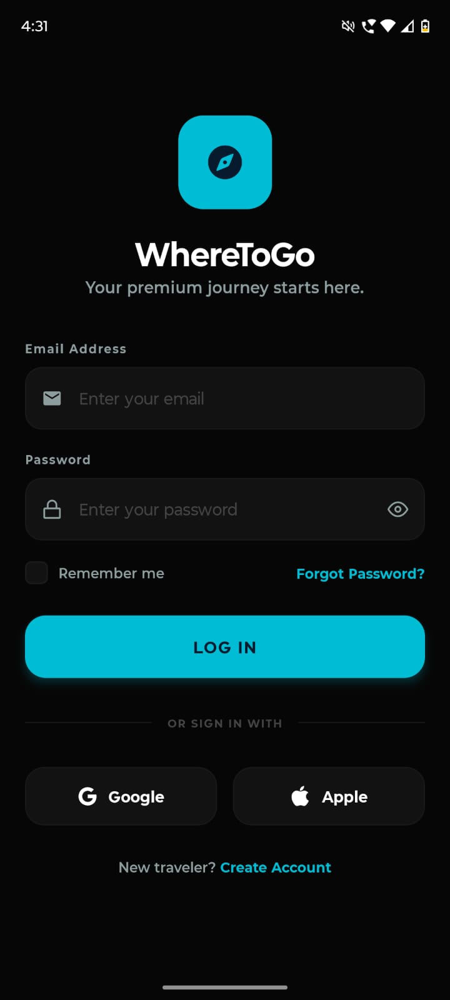 |
| **02** | **Home Dashboard** | Home explore interface featuring regional selection, search, nearest spots, and popular suggestions. | 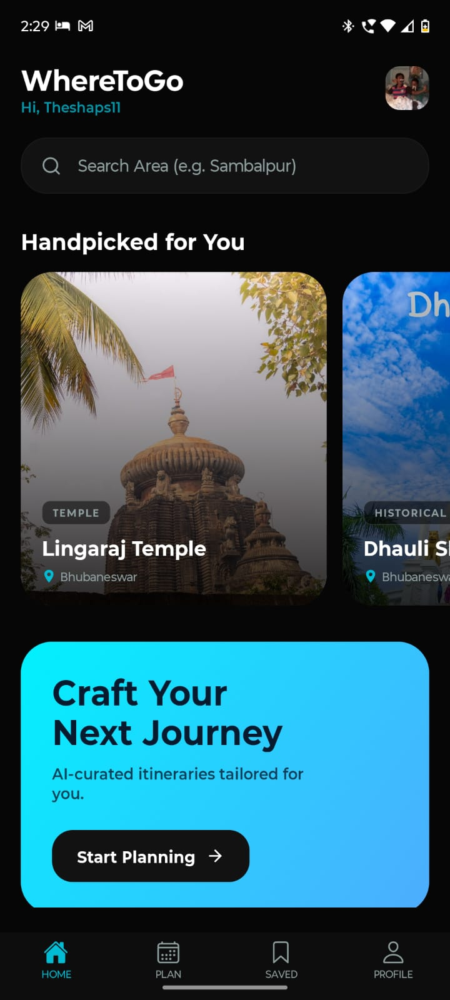 |
| **03** | **Discovery Reels** | Full-screen vertical auto-play video feed streaming curated destination clips from Supabase Storage CDN. | 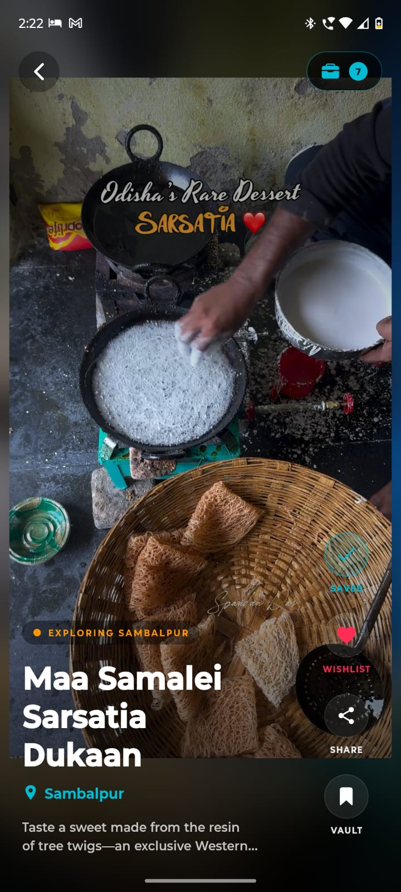 |
| **04** | **Place Details** | Parallax scroll detail screen presenting editorial descriptions, hours, ratings, and image gallery. | 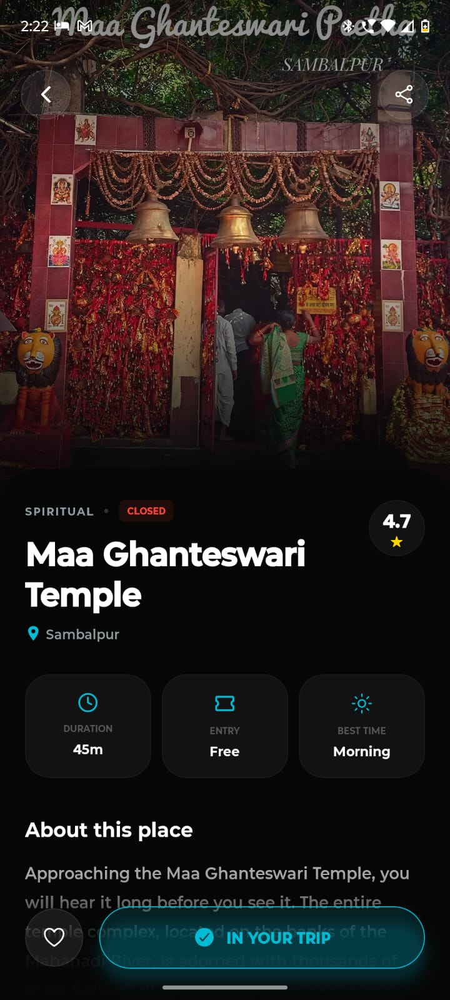 |
| **05** | **Stay Hub Map** | Geocodes depot stay location and displays interactive map pins for selected destinations. | 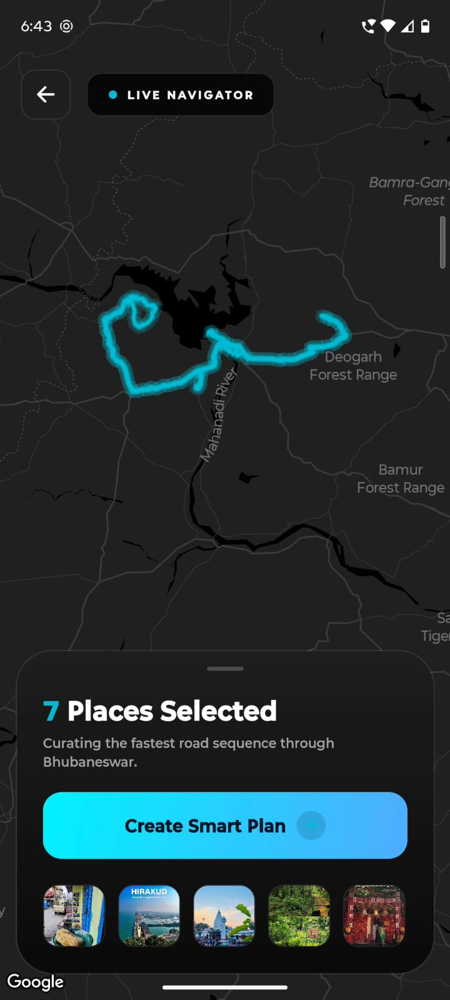 |
| **06** | **Planner Setup** | Configures date ranges, daily duration, budget constraints, and place wishlist. | 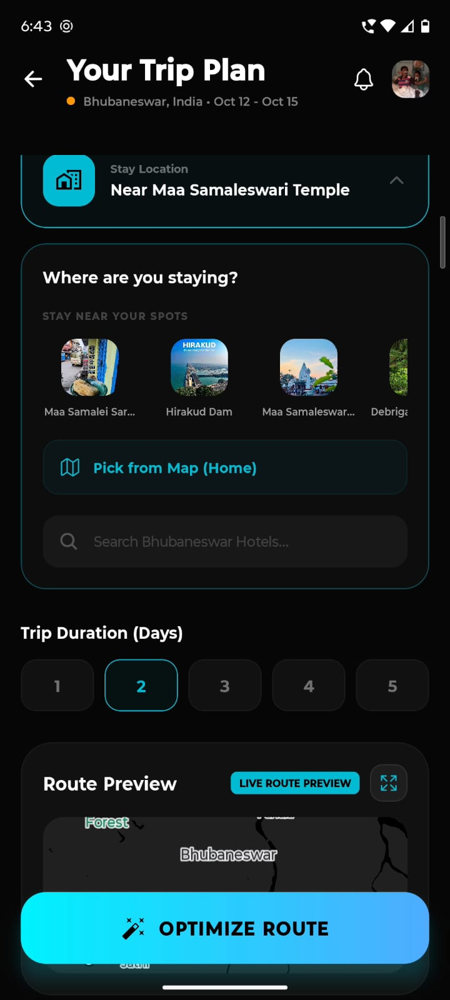 |
| **07** | **Optimization Loader** | Branded computational state showing live status logs for the active Clarke-Wright algorithm calculation. | 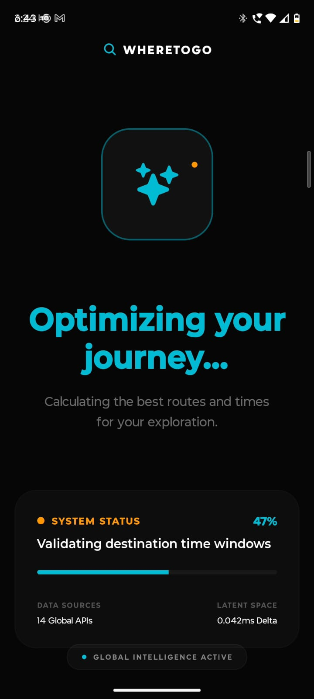 |
| **08** | **Itinerary Summary** | Editorial day-by-day itinerary summary showing optimized sequence and computed timings. | 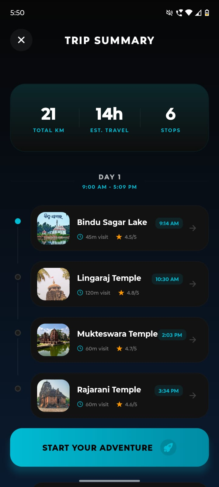 |
| **09** | **Active Execution** | Interactive timeline with arrival times, check-in toggles, and external navigation linking. | 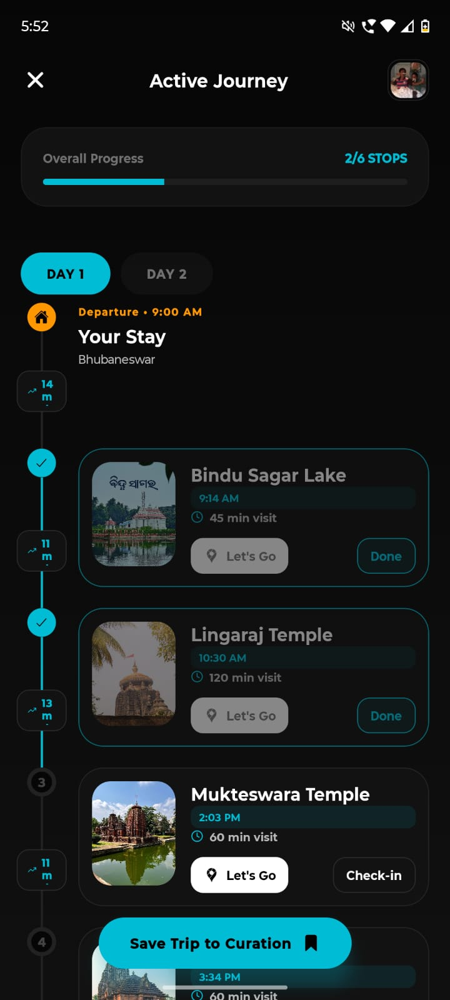 |
| **10** | **Saved Trips** | Organizes user's travel history into draft/complete itineraries and wishlist carousels. | 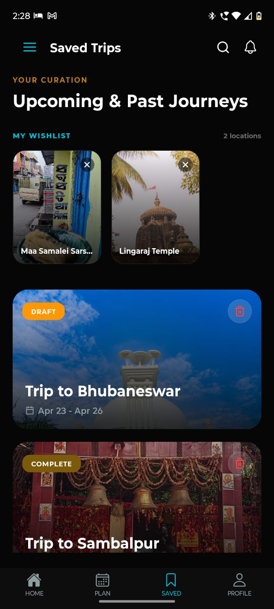 |
| **11** | **Profile Dashboard** | Explorer profile tracking travel stats, completed stops, total distance in KM, and curator milestone badges. | 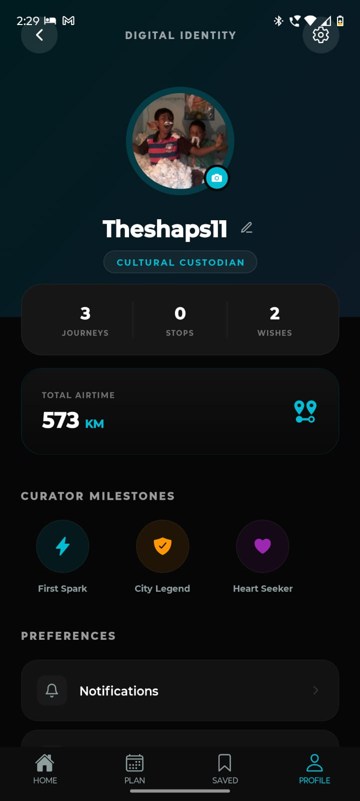 |

---

## 🧠 Core Algorithmic Framework

WhereToGo models trip curation as a single-vehicle, multi-constraint, time-dependent Vehicle Routing Problem with Time Windows (TD-VRPTW).

### Time-Dependent Clarke–Wright Heuristic (TD-CW)
The classical Clarke–Wright Savings Algorithm computes route merging savings using static spatial distance:

$$S(i,j) = d(D,i) + d(D,j) - d(i,j)$$

WhereToGo extends this formulation to the time-dependent domain by replacing static distance $d(u,v)$ with traffic-aware travel durations $t(u,v,H)$ departing at time $H$ (queried via Google Distance Matrix API's `duration_in_traffic` parameter):

$$S(i,j,H) = t(D,i,H) + t(D,j,H) - t(i,j, H + t(D,i,H))$$

The third term $t(i,j, H+t(D,i,H))$ accounts for the elapsed travel duration to waypoint $i$ before departing to $j$. This propagates cascading traffic delays through subsequent legs of the itinerary.

### Multi-Variable Constraints Matrix
A route merge is accepted only when all six constraint dimensions are simultaneously satisfied:

*   **Depot Anchoring**: All daily routes must start and end at the stay location ($D$), geocoded via Google Geocoding API.
*   **Opening Time Window**: Arrival time at stop $i$ must satisfy: $t_{\text{arrival}}(i) \ge t_{\text{open}}(i)$ (queried dynamically via Google Places API).
*   **Closing Time Window**: Visit completion time must satisfy: $t_{\text{arrival}}(i) + s_i \le t_{\text{close}}(i)$ (where $s_i$ is the average visit duration).
*   **Traffic-Adjusted Buffer**: Arrival at the next stop is computed as: $t_{\text{arrival}}(i+1) = t_{\text{arrival}}(i) + s_i + t_{\text{traffic}}(i, i+1)$.
*   **Day Capacity**: Cumulative daily travel and visit times cannot exceed **540 minutes** (9 hours).
*   **Fixed Departure**: Route chains are computed forward from a hard 09:00 AM depot departure.

---

## 🏛️ System Architecture & Database Design

WhereToGo is built on a clean, decoupled four-layer architecture coordinated via a centralized Mediator.

### Orchestration & Mediator Pattern
All application state (`curated_places[]`, `stay_location`, `num_days`, `optimized_itinerary[]`) is centralized inside [TripContext.tsx](file:///c:/Users/Unik\Downloads/WhereToGoGlobal/context/TripContext.tsx). Screens never hold business logic or communicate directly, enforcing clean decoupling.

### Five-Tier Caching & Persistence Model
To optimize latency and minimize API costs, a tiered architecture is implemented:
1. **Tier 1 (useState / TripContext)**: Zero-latency reactive UI rendering.
2. **Tier 2 (AsyncStorage L1 Cache)**: Local client persistence with a 7-day TTL.
3. **Tier 3 (Supabase `route_cache` L2 Cache)**: Server-side table caching Distance Matrix results between known catalog destinations. Reduces duplicate query API costs to zero.
4. **Tier 4 (Google Distance Matrix API)**: Triggered only on cache misses or manual traffic refreshes.
5. **Tier 5 (Supabase PostgreSQL)**: Receives atomic writes on save events, secured with Row-Level Security (`auth.uid() = user_id`).

### Secure API Gateway Integration
To prevent Google Maps API key exposure on compiles, all geospatial requests pass through a secure gateway implemented via **Supabase Edge Functions** (Deno/TypeScript). The client signs requests with a Supabase User JWT, and the function validates the token, injects the encrypted server-side API key, and returns a stripped GeoJSON payload.

### Database Schema (Supabase PostgreSQL)
*   **`public.places`**: Master constraint source (slug, coordinates, opening/closing times, duration, video URL).
*   **`public.trips`**: Itineraries containing JSONB geocoded stay location, day count, and status flags.
*   **`public.profiles`**: User statistics (total kilometers, journeys count, and curator titles).
*   **`public.user_activity`**: Tracks wishlists and visited destinations.
*   **`route_cache`**: L2 cache for Distance Matrix queries with a 7-day TTL.

---

## 🛠️ Technology Stack

| Layer | Component / Technology | Architectural Rationale |
| :--- | :--- | :--- |
| **Frontend Framework** | React Native (Expo SDK 54) | Single TypeScript codebase compiling to native iOS, Android, and Web. |
| **Routing** | Expo Router V3 | Declarative, file-based routing with native layout animations. |
| **Animation Engine** | Reanimated 3 | Thread-decoupled animations maintaining 60 FPS under concurrent rendering. |
| **Mapping & SDK** | Google Maps SDK (React Native) | High-performance vector rendering, custom light/dark overlays, and familiar UX. |
| **Geocoding & Autocomplete** | Google Geocoding & Places APIs | Sub-5m coordinates resolution; time-zone-aware opening hours. |
| **Traffic Optimization** | Google Distance Matrix API | High-fidelity traffic duration estimation for TD-CW engine. |
| **Route Geometry** | Google Directions API | Decodes and renders traffic-layered polylines dynamically. |
| **Database & Auth** | Supabase (PostgreSQL with RLS) | Strict relational constraints, JWT authentication, and row-level data isolation. |
| **API Gateway** | Supabase Edge Functions (Deno) | Secure TypeScript proxy shielding Google keys from mobile client bundles. |

---

## 📊 Benchmarks & Validation Results

### Performance Benchmarking Results
Audits conducted using React Native Debugger, Expo's built-in FPS monitor, and the Flashlight profiling tool across multiple Android test devices (Snapdragon 680, Snapdragon 720G, and Dimensity 700) demonstrate the following results:

| Metric | Target / SLA | Achieved Value | Status |
| :--- | :--- | :--- | :---: |
| **App Startup** (tap-to-interaction) | < 3.0 seconds | 2.8 seconds | ✓ Pass |
| **Discovery Reel Scroll** | ≥ 58 FPS | 58–60 FPS | ✓ Pass |
| **Map Scrolling & Interaction** | ≥ 58 FPS | 58–60 FPS | ✓ Pass |
| **Clarke-Wright Optimization** (7 stops) | < 2.0 seconds | 180ms (L1/L2 Cache) / ~0.9s (Cold) | ✓ Pass |
| **OSRM Route Fetch & Polyline Render** | < 1.5 seconds | ~0.7 seconds | ✓ Pass |
| **Map Memory Overhead** (Raster vs Vector) | ≥ 25% reduction | ~30% reduction | ✓ Pass |
| **White Flash on Startup** | Zero occurrences | Zero occurrences | ✓ Pass |
| **Cold-Start Session Restore** (AsyncStorage) | < 0.5 seconds | ~0.2 seconds | ✓ Pass |

### User Acceptance Testing (UAT) Summary
A comprehensive UAT phase was executed with 5 independent testers to validate correctness and user journeys:

| Test Scenario | Success Criteria | Achieved Result | Status |
| :--- | :--- | :--- | :---: |
| **Discovery-to-Journey Flow** (New User) | 100% first-attempt success | 5/5 testers succeeded | ✓ Pass |
| **Route Time-Window Validation** (Open) | No arrival scheduled before open times | Verified on all Sambalpur/Bhubaneswar routes | ✓ Pass |
| **Route Time-Window Validation** (Close) | No arrival scheduled after close times | Confirmed for all 40 catalog places | ✓ Pass |
| **Multi-Day Route Balancing** | Balanced day distribution by time limits | Verified for 2-day and 3-day split trips | ✓ Pass |
| **Itinerary Cold-Start Persistence** | Zero data loss on cold app restart | Saved state fully restored via AsyncStorage | ✓ Pass |
| **Atomic Database Trip Sync** | Full trip JSONB saved on Supabase DB | Confirmed in Supabase Table Editor | ✓ Pass |
| **Esri Map Tile Performance** | Tile rendering without Access Denied errors | Clean raster tiles loaded without latency | ✓ Pass |
| **Journey Checklist & Progress Tracker** | Progress bar = (completed/total) * 100% | Verified for 3/6 and 6/6 stop scenarios | ✓ Pass |

### Legacy Ecosystem Comparison & Evaluation
Instead of comparing against a single competitor, WhereToGo was evaluated against GIS tools (Google Maps), Social Curation (Instagram/TikTok), and Static Directories (TripAdvisor) across design philosophy, route optimization capabilities, temporal constraints validation, and content delivery layout:

<div align="center">
  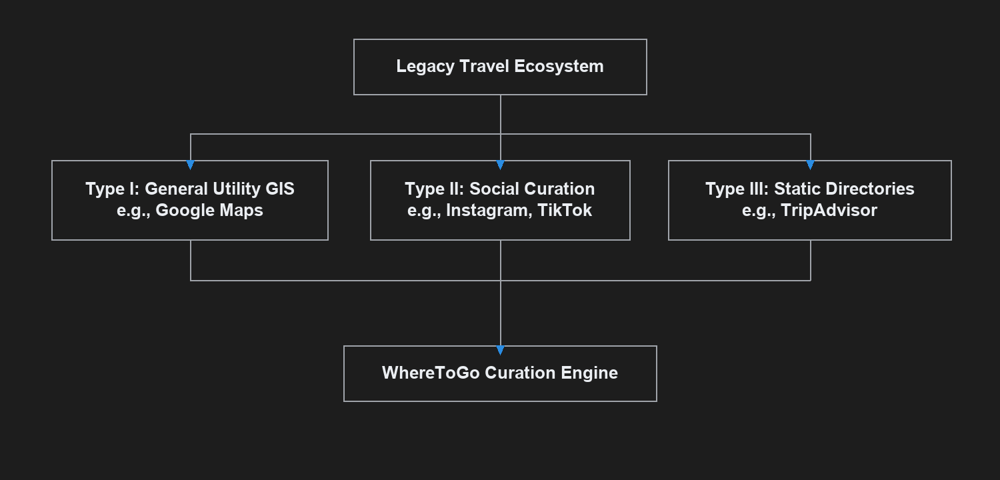
  <br/><br/>
  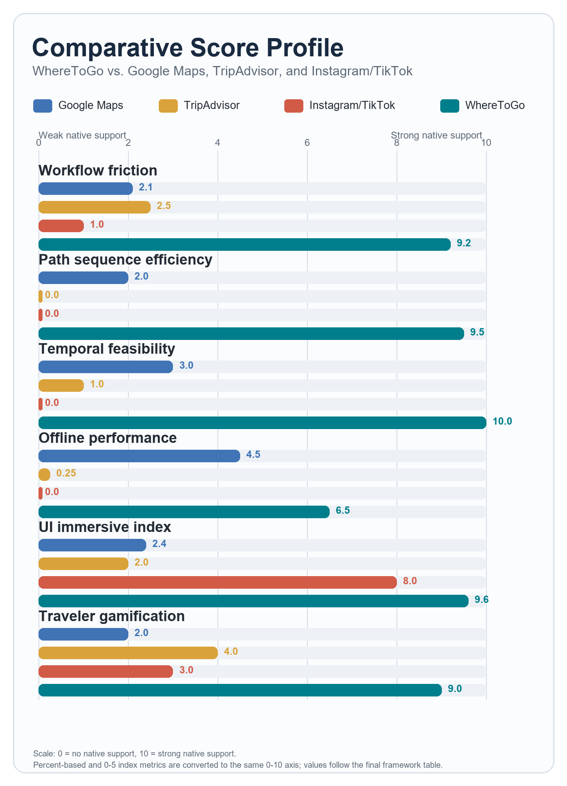
</div>

---

## 📂 Project Structure

```text
WhereToGo/
├── app/                  # File-based routing (Tabs, Auth, and Journey Screens)
│   ├── (tabs)/           # Home, Plan, Saved, and Profile Tabs
│   ├── details.tsx       # Place Detail & Gallery View
│   ├── discovery.tsx     # Cinematic Reels Feed (expo-video integration)
│   ├── planner.tsx       # AI Optimization Setup & Stay Hub
│   ├── journey.tsx       # Optimized Itinerary Timelines
│   └── loader.tsx        # Branded optimization loading screen
├── assets/               # App assets & App Flow documentation screenshots
├── components/           # Reusable UI widgets and custom MapViewShim (Web/Mobile)
├── constants/            # Global HSL Colors palette & place metadata structure
├── context/              # Context Providers (TripContext and ThemeContext)
├── scripts/              # Migration scripts (local SQLite to Supabase CDN)
└── services/             # API services (SupabaseClient & PlaceService query engine)
```

---

## 🚀 Getting Started

### Prerequisites
* [Node.js](https://nodejs.org/) (v18+)
* [Expo Go](https://expo.dev/expo-go) app installed on Android or iOS
* [Git](https://git-scm.com/)

### Installation
1. **Clone the repository**:
   ```bash
   git clone https://github.com/Sudiptermux/WhereToGo.git
   cd WhereToGo
   ```

2. **Configure environment variables**:
   Create a `.env` file in the root directory:
   ```env
   EXPO_PUBLIC_SUPABASE_URL=https://your-supabase-project-id.supabase.co
   EXPO_PUBLIC_SUPABASE_ANON_KEY=your-anon-key
   ```

3. **Install dependencies**:
   ```bash
   npm install
   ```

4. **Start the server**:
   ```bash
   npx expo start
   ```

5. **Launch the application**:
   * Scan the QR code using **Expo Go** to run on your phone.
   * Press `w` to run the client-only single-page web app in your browser.

---

*Curated with ❤️ by the WhereToGo Development Team.*
